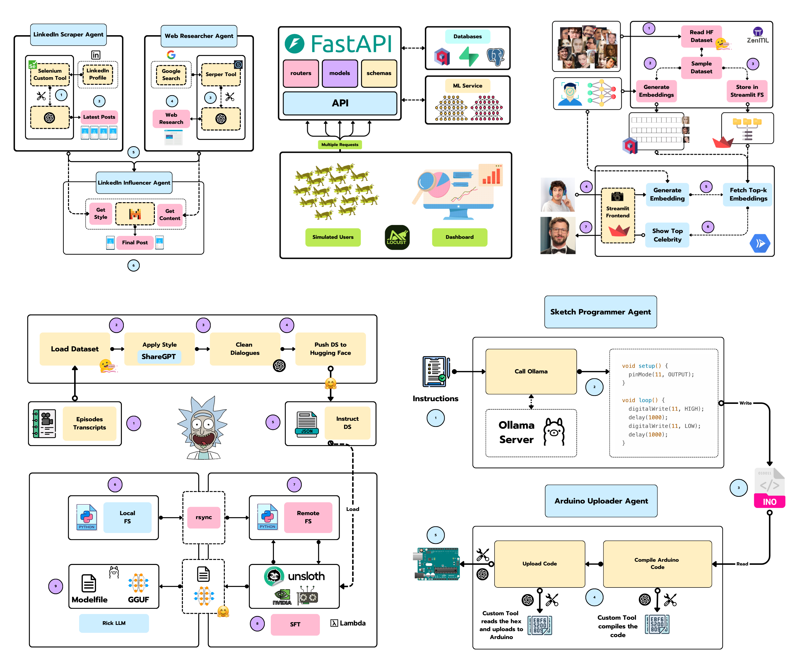
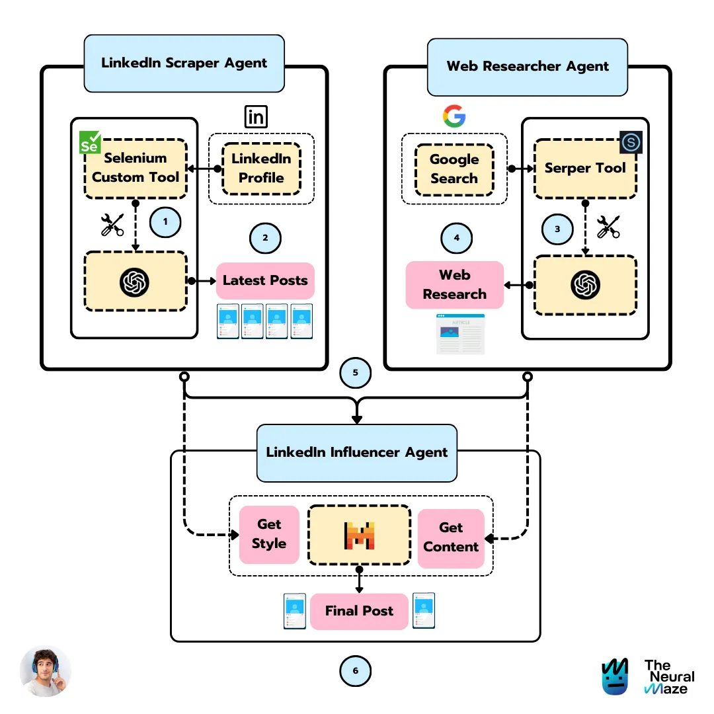
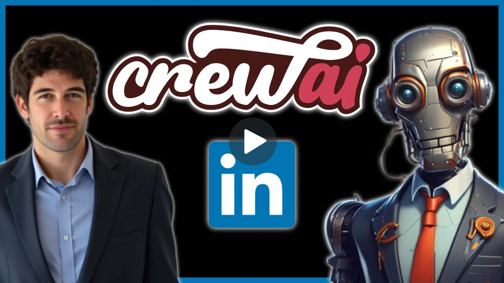
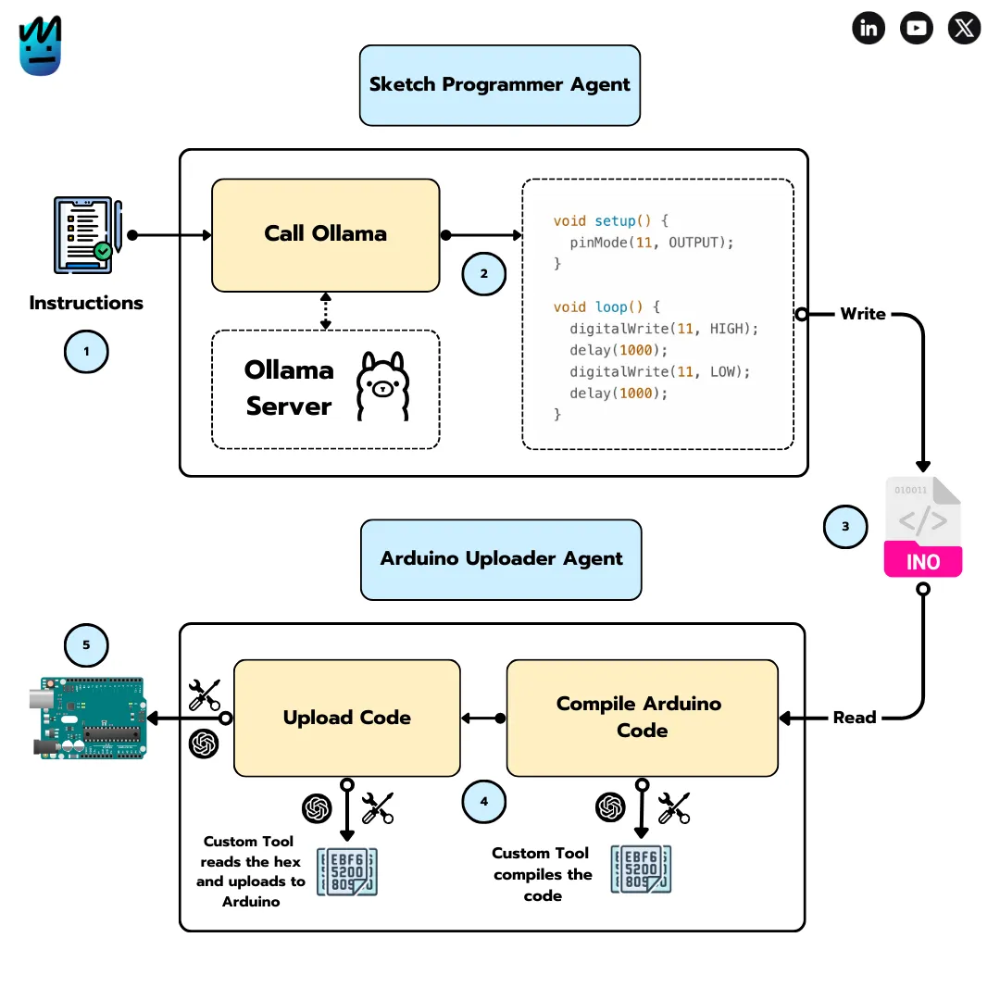
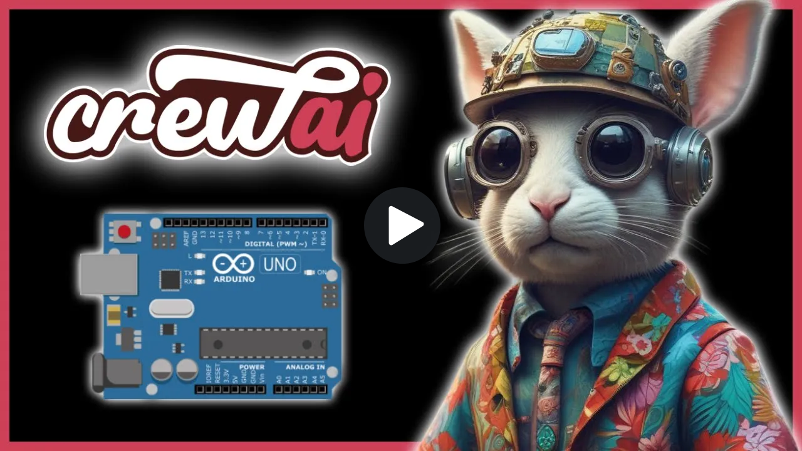
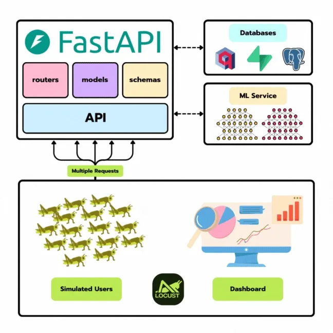
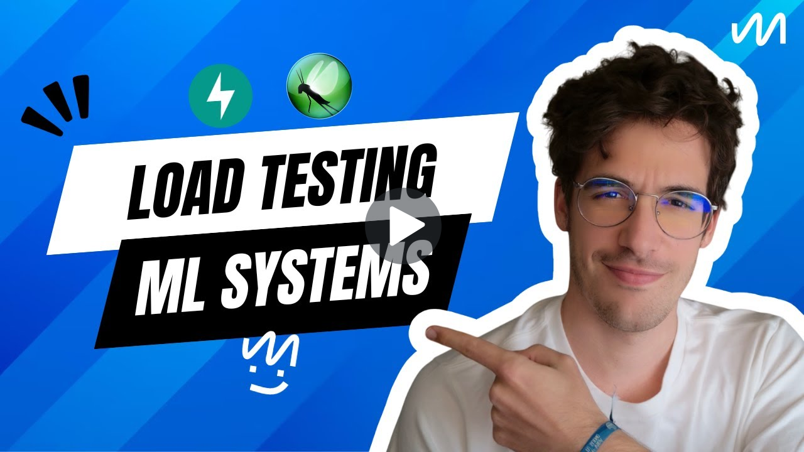
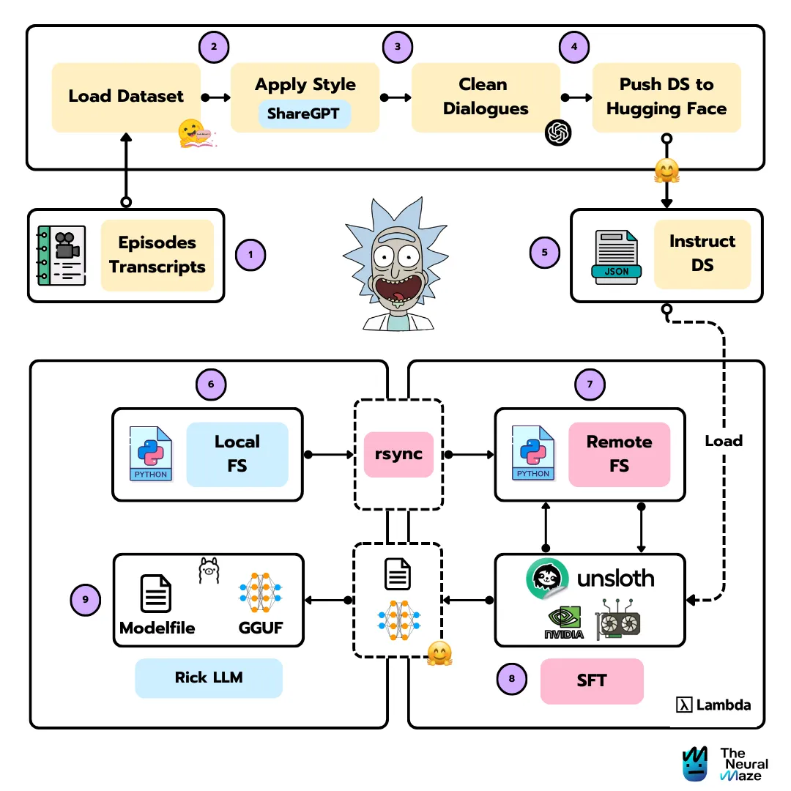
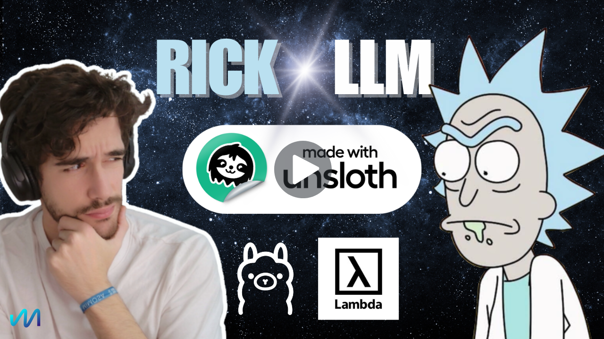

  <h1>The Neural Hub</h1>
  <h3>Hands-on projects for ML & AI Engineers</h3>

 

    

## Table of Contents

- [What is The Neural Hub?](#what-is-the-neural-hub)
- [Projects](#projects)
- [Contributors](#contributors)
- [License](#license)

## Welcome to The Neural Hub!! 👋 

This is where I share code from my projects and tutorials. Every project in this repo comes with a [written article](https://theneuralmaze.substack.com/) and a [YouTube video](https://www.youtube.com/@TheNeuralMaze), so you can dive in whichever way you prefer (or both!).

These aren't full-blown courses like [PhiloAgents](https://github.com/neural-maze/philoagents-course), [Ava](https://github.com/neural-maze/ava-whatsapp-agent-course), or the [Agentic Patterns Course](https://github.com/neural-maze/agentic-patterns-course). Those go much deeper. Instead, the projects here are designed to be quick, focused builds you can knock out in an evening or two. Each one teaches a specific concept in ML or AI engineering, making it easier to learn by doing.

 
Curious about what's inside? Keep scrolling! 👇

---

<table style="border-collapse: collapse; border: none;">
  <tr style="border: none;">
    <td width="20%" style="border: none;">
      
    </td>
    <td width="80%" style="border: none;">
      

        <h2>📬 Stay Updated</h2>
        
<b><a href="https://theneuralmaze.substack.com/">Join The Neural Maze</a></b> and learn to build AI Systems that actually work, from principles to production. Every Wednesday, directly to your inbox. Don't miss out!

      

    </td>
  </tr>
</table>

  

## Projects

| Project | Article | Video | Description | Code |
|---------|---------|-------|-------------|------|
LinkedIn Influencer Agent |   |  | Build a LinkedIn Influencer Agent using CrewAI. | [linkedin-influencer-agent](linkedin-influencer-agent) |
Arduino Agent |  |  | Build an Arduino Agent using CrewAI. | [arduino-agent](arduino-agent) |
Locust Guide |  |  | How to load test Machine Learning Systems. | [locust-guide](locust-guide) |
Rick LLM |  |  | Learning LLM finetuning by building your own Rick Sanchez assistant (Llama 3.1) | [rick-llm](rick-llm) |

## Contributors

<table>
  <tr>
    <td align="center"></td>
    <td>
      <strong>Miguel Otero Pedrido | Senior ML / AI Engineer </strong> 
      <i>Founder of The Neural Maze. Rick and Morty fan.</i>  
      <a href="https://www.linkedin.com/in/migueloteropedrido/">LinkedIn</a> 
      <a href="https://www.youtube.com/@TheNeuralMaze">YouTube</a> 
      <a href="https://theneuralmaze.substack.com/">The Neural Maze Newsletter</a>
    </td>
  </tr>
</table>

## License

This project is licensed under the MIT License. See the [LICENSE](LICENSE) file for details.

---

<table style="border-collapse: collapse; border: none;">
  <tr style="border: none;">
    <td width="20%" style="border: none;">
      
    </td>
    <td width="80%" style="border: none;">
      

        <h2>📬 Stay Updated</h2>
        
<b><a href="https://theneuralmaze.substack.com/">Join The Neural Maze</a></b> and learn to build AI Systems that actually work, from principles to production. Every Wednesday, directly to your inbox. Don't miss out!

      

    </td>
  </tr>
</table>

  

