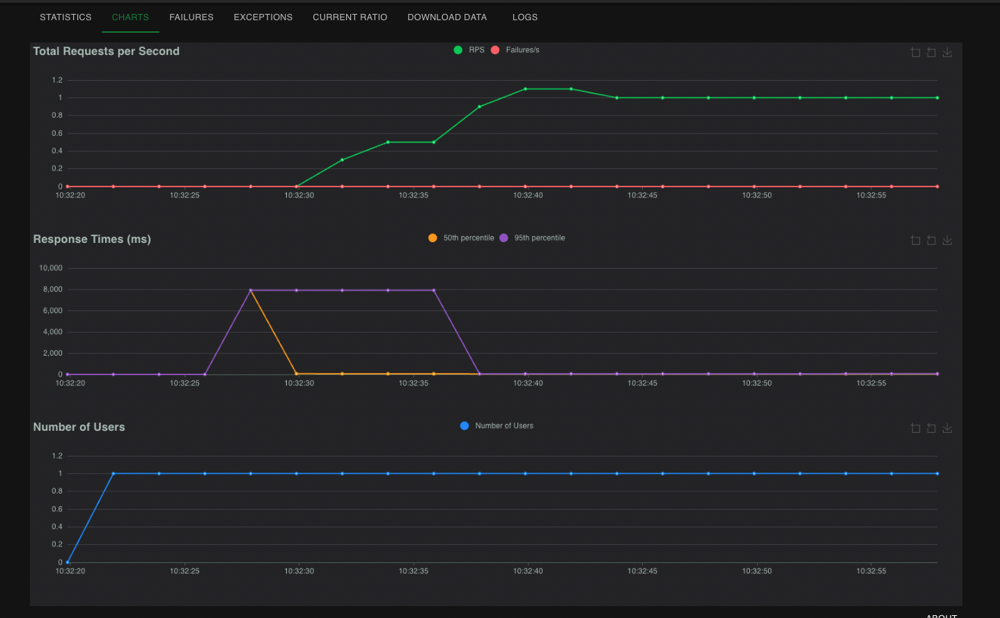

<p align="center">
    
    <h1 align="center">Load Testing Machine Learning Systems</h1>
    <h3 align="center">Running load tests on a FastAPI application using Locust</h3>
</p>

This project is a simple demonstration of how to use [Locust](https://locust.io/) to run load tests on a machine learning application built with FastAPI. 
The following sections will walk you through setting up the project, creating the FastAPI application (using [Docker Compose](https://docs.docker.com/compose/)) and running the load tests.

---

## Table of Contents
- [Project Overview](#project-overview)
- [Prerequisites](#prerequisites)
- [Running the API using Docker](#running-the-api-using-docker)
- [Running Locust](#running-locust)
- [Monitoring Results](#monitoring-results)
- [YouTube Video](#youtube-video)
---

## Project Overview

This project includes:

- A **FastAPI** application that performs basic sentiment analysis, located in the `api/` directory. If you are curious about the model used under the hood, it's [DistilBERT](https://huggingface.co/docs/transformers/en/model_doc/distilbert). For interacting with this model, the application uses a pipeline from the `transfomers` library.

- A **Locust** configuration for simulating different user loads and testing the API's response under stress.

The application exposes an endpoint where users can send text data and receive a sentiment score in response. Locust allows us to generate concurrent traffic and monitor the FastAPI app's performance, measuring response times, failure rates, and throughput under various load levels.

---

## Prerequisites

Before proceeding, ensure you have the following installed:
- **Python 3+**
- **Docker** 
- **uv** 


## Setting Up the Project

1. **Clone the repository:**

```bash
git clone https://github.com/neural-maze/locust_example.git
cd locust_example
```

2. **Install dependencies:**

```bash
uv venv .venv
source .venv/bin/activate
uv pip install -e .
```

## Running the API using Docker

The api/ directory contains a simple FastAPI app for sentiment analysis. Here’s how to set it up:

```bash
make api-up
```

If everything worked fine, you should be able to access the FastAPI application at `http://0.0.0.0:8000/`. If you want to check the available endpoints, use this route: `http://0.0.0.0:8000/docs`

## Running Locust

Once the API is running, you can start load testing with Locust. Take a look
at the [locustfile](src/locustfile.py) to see how the load tests are defined in Locust. To start the Load Tests, run this command:

```bash
make run-locust
```

Now it's time to access the Locust UI. Open your browser again and navigate to `http://0.0.0.0:8089`. Here you can specify the number of users to simulate and also the spawn rate. When you are OK with the params, click the "START" button! 


## Monitoring Results

The Locust dashboard provides real-time statistics:

- Requests per second (RPS): Monitors throughput.

- Response time: Tracks how long the API takes to respond.

- Failure rate: Shows error rates, if any requests fail.

These metrics are helpful to understand how well your API performs under varying loads.



## YouTube Video

If you prefer a video tutorial, you can also check my YouTube video.

<div align="center">
    <a href="https://youtu.be/31lSQ2xyFCA?si=Y1pQV9WhQMKiMigO">
        
    </a>
</div>